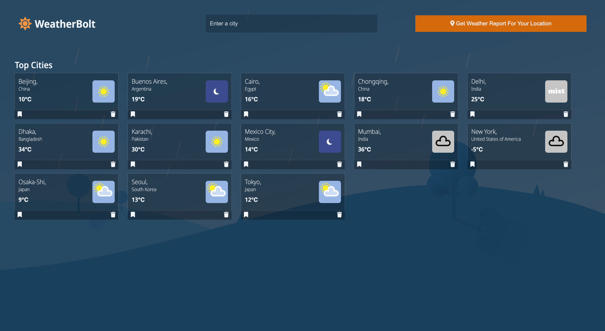

# Weatherbolts - Much more than just the weather

## Table of contents

- [Overview](#overview)
  - [The challenge](#the-challenge)
  - [Screenshot](#screenshot)
- [My process](#my-process)
  - [Built with](#built-with)
  - [Continued development](#continued-development)
- [Author](#author)

## Overview

### The challenge

Users should be able to:

- View the optimal layout for the app depending on their device's screen size
- See hover states for all interactive elements on the page
- View weather information for the top cities in the world
- Make a bookmark of their of favorite cities by clicking on the bookmark button
- Delete cities that they are not interested in
- View more information by clicking on the various city cards by redirecting to another page
- Search for other cities by typing into the input field
- Check the current weather condition in their own current location

### Screenshot

### Links

- Live Site URL: [Add live site URL here](https://weatherbolts.netlify.app/)

## My process

### Built with

- Semantic HTML5 markup
- CSS custom properties
- Flexbox
- Mobile-first workflow
- Javascript

### Continued development

Users should be able to drag and drop cards to change the arrangement of cards

## Author

- Twitter - [@yourusername](https://www.twitter.com/afolasope_)

